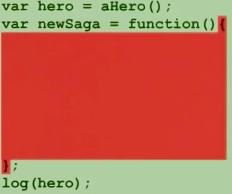
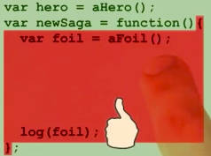
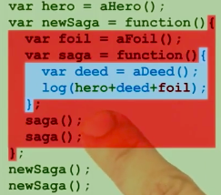
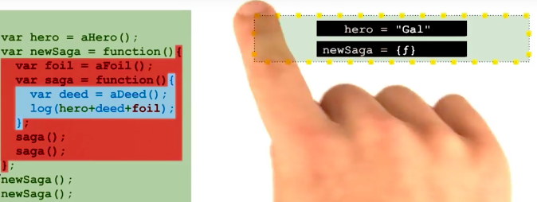
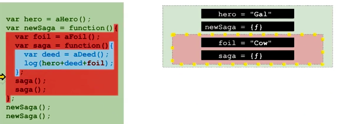
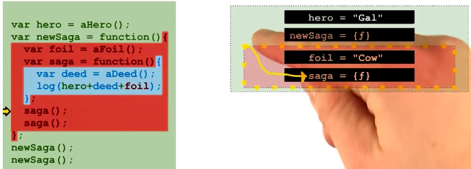
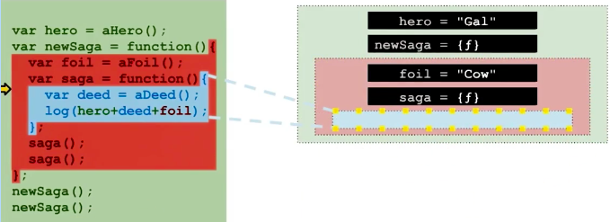
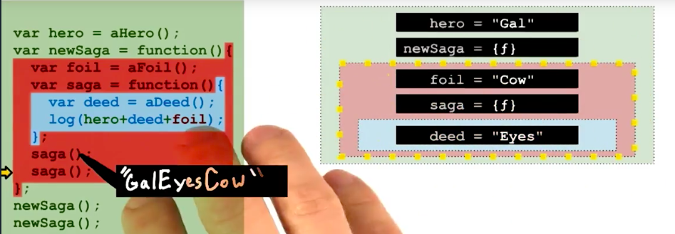
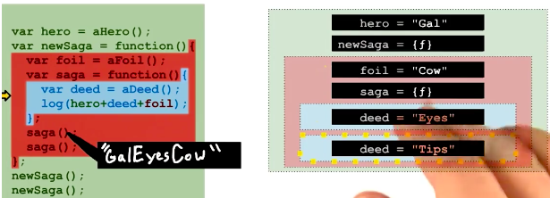
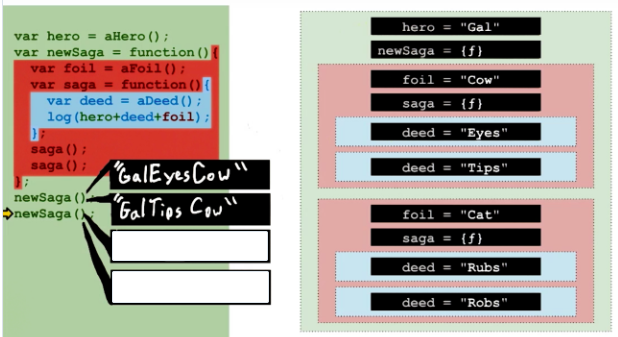

# 作用域和闭包

然后我们将讨论参数this及原型委托

# 作用域示例

让我们写一个程序，用随机的词编写一些滑稽的故事，每次我们调用这个程序中的一些函数，他都会帮助我们把名词、动词连贯起来成为一个句子组成关于一位主角的传奇故事，一旦我们启动这个程序，所有的故事都是围绕着那个随机选择的主角展开，每一个故事都会有一个随机选择的不同的配角，这个程序将会调用函数，将名词、动词连贯为一个新的组合，然后为这个进行中的故事加上一个句子。就是这样，这是一个简短句子，让我们看看如何利用javascript作用域的特性来实现它。

# 词法作用域

作用域这个词有很多种使用方式，首先我跟大家探索最简单的方式，作用域这个词的第一种用法是词法作用域，这种用法描述了你的源代码的范围，在这个范围中你可以使用变量名引用变量而不出现访问错误，这种作用域具体的规则即便不运行代码也很容易理解，因为它仅代表你的代码中的不同变量名有意义的区域。假设这个文件包含了一个非常简单的程序的源代码，在这个没有任何函数的简单程序中仍包含了一个作用域，它被称为全局作用域，这个变量中的每一个变量都存储在其中，我们使用这片绿色区域代表全局作用域，如今在某些javascript环境中 全局作用域被多个不同的文件共享，使得程序任意部分都可以和其他部分交互，如果我们在程序中添加一个变量，这个变量就存在于全局作用域中，因此在整个程序的任意位置都可以访问这个变量。现在我们希望这个程序能帮助我们生成关于同一个主角的不同故事，因此我们将hero这个变量放在全局作用域中，每一行代码都可以引用这个变量，同时，在这个示例中，我们要假装这里存在一个名为aHero的函数，这个函数将返回一个随机生成的名字。`var hero=aHero();`,在这里我们并不研究代码或该函数的运行原理，在全局作用域中声明变量之后就可以在该词法作用域的任意位置引用这个变量hero了.

# 变量访问权限

```
var hero=aHero();
var newSaga=function(){
};
log(hero)
```
每当你定义一个函数就会创建一个新的词法作用域，函数定义包含从字母f开始，一直到结尾的花括号之间的内容，函数体两端花括号内的代码适用于不同的访问规则。我们将此花括号间的区域标红，表示他使用不同的规则，可视为一个新的词法作用域，如图。


通过定义函数的放式创建的词法作用域比其外层的词法作用域要多一些限制，虽然你仍然可以访问其外层作用域中的变量，你也可以访问在这个内层作用域中定义的变量。

但是该内层作用域中的变量无法在该作用域之外被访问，在这对花括号范围之外，引用内层作用域中的局部变量将导致错误，在这对花括号内你觉得可以访问那些变量呢？
 
 * hero
 * newSaga
 * foil

答案是三个都可以。

# 7 作用域限制

请注意一个地方,javascript允许给未声明的变量赋值， 只有函数的花括号才能限制作用域，if那些循环结构的是不可以的。

# 8 调用函数



# 9 执行环境简介

上面已经将这个程序中的词法作用域都列出来了，看到了如何区分不同的词法作用域，也学会了控制它们的规则，现在我们就来谈谈作用域这个词的另一种用法，当程序运行的时候就创建了一个用于保存变量和变量值的存储系统，这些内存中的作用域结构就被称为执行环境。

# 10 执行环境与词法作用域

执行环境或内存作用域与词法作用域有所不同，它是在代码运行时才被创建 而不是在代码被输入时，它的规则可以控制在程序执行过程中的，不同阶段可以访问哪些变量，让我们来探索一下在不同环境中运行时访问变量的情况。

#  11 内存中的数据存储

程序运行时将会创建内部的数据存储，来记录可供不同函数对象访问的所有变量，我将在右侧把它用图表表示出来，这是我们内存系统中的一个图表，由于函数的每一次运行都完全独立于此前的任何一次运行，每次函数运行时就会创建一个新的运行环境，因此每个词法作用域在运行的过程中可能会创建多个内存作用域，可能一个也没有，这完全取决于此函数运行了多少次，为了检查执行环境，我们需要运行这个程序，黄色箭头表示解释器，在第一行代码运行之前解释器就开始配置执行环境，第一步是在内存中创建一个全局作用域环境以保存所有全局变量，当第一行代码运行时解释器就会在执行环境中创建一个新的键值映射以记录变量名hero对应的值，函数aHero随机生成了值Gal,这个值将被存储在变量hero中，正如上一行代码，这一行代码也有简单的赋值运算，这次被赋予的值是一个跨越了几行的函数，但解释器将暂时忽略红色和蓝色区域的代码，这些代码只会在这些函数被调用时运行。因此这行代码的作用是将一个新的键值对添加到我们的全局作用域环境中。如下图所示：


# 12 内存作用域与内存对象

现在这个执行环境看起来像是键值对的集合，这与对象有点类似，它们的相似之处的确容易让人误以为内存对象和内存作用域是一回事，这个的相似之处非常具有欺骗性，因为它们都由解释器完全分开保存，而且在访问执行环境时的很多限制在访问对象时并不存在，很多我们学过的规则也恰好可以应用于执行环境，但是你绝对不能在程序中混合使用，除了这些相似之处，它们存在于完全不同的世界，几乎永不交互，举例说明一下 你绝对不可能存储一个包含很多环境的数组但却可以存储一个包含很多对象的数组，你无法像在对象中遍历对象的key值那样，在执行环境中去遍历变量名。因此 虽然它们都是key-value数据存储结构但你只能使用完全不同的方式与它们交互。

# 13 预测执行环境的输出

继续看下一行代码，运行函数newSaga(),将创建一个新的执行环境来为该函数新的局部变量提供空间，然后在该函数保持运行的情况下，新的执行环境将变为解释器新的当前环境，这里的第一行代码将为当前的作用域创建一个新变量，下一行代码在红色作用域添加另一个新变量，这个变量的值为一个函数的值如图。

现在我们要在变量saga中查找一下，为了明确这对括弧到底在调用那个函数，解释器将检查变量saga是否在其当前环境-即红色区域中具有意义，解释器检查当前环境发现可以在红色区域中访问变量saga如下图。


此处查找到的值为一个函数对象，saga后面的括号告诉解释器调用该函数，运行这个函数saga将创建一个新的执行环境并将解释器的搜索起始范围移至其中。


第一行代码`var deed=aDeed()`在该局部作用域中添加了一个新变量，
现在我们需要查找所有的三个变量了，同样地解释器将从当前环境向外层搜索查找符合搜索词的最近结果，首先查找hero,无法在当前环境中找到结果于是在红色区域中继续查找，还是无法找到变量hero,最终一直找到全局环境终于找到该变量，log()中字符串开始渐渐成型，接着继续查找变量deed,这次查找会输出什么结果？解释器查找deed比查找hero要容易，无需向外层其他作用域查找，解释器在当前局部作用域中就能找到它。

# 14 构建多个执行作用域

最后解释器查找变量foil,当前作用域中没有然后在中间的作用域找到了它，解释器完成查找以后将串联起来的字符串输出到系统日志，这也是该函数最后一行代码，解释器可以跳回该函数被调用的位置，然后继续处理。同时作用域会变成之前的红色区域，到目前为止，右侧的内存环境图表看起来和左侧的词法作用域表很相似，目前的唯一区别在于右边显示了实际的值，而左边的代码完全没有。



那么内存作用域和词法作用域究竟有什么区别呢？saga函数在第二次运行的时候你就知道了。

# 15 继续预测输出

刚才的过程将重复一遍，但是第二次运行saga会创建一个全新的执行环境，而不是使用刚才的蓝色内存，这个环境用于存储新的绑定，在这个环境中var声明创建了一个新的变量，从该语言使用的数据存储布局来讲，这个变量是存储在跟第一个变量完全不同的新区域当中，虽然这不一定完全符合实际情况，但是基本是正确的。



# 16 完成我们的预测

左边蓝色区域的函数完成运行后，解释器跳回到函数被调用的位置，当前环境也扩展到外层，此外这都是第一次调用newSaga的过程，现在这个过程已经完成，第二次运行函数newSaga我们将重新绘制一个新的红色区域，其中包含两个新的蓝色区域，几乎完全重复之前的步骤，实际上它们是被存储在一个完全不同的变量saga中，它们并不严格相等。就像下面的也是并不严格相等的。

```
var makeArray=function(){
return [];
};

var array1=makeArray();
var array2=makeArray();
log(array1===array2)
```



