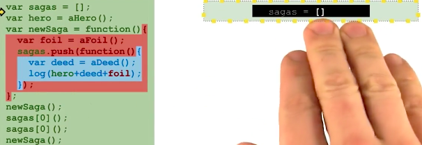
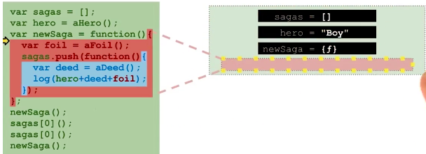
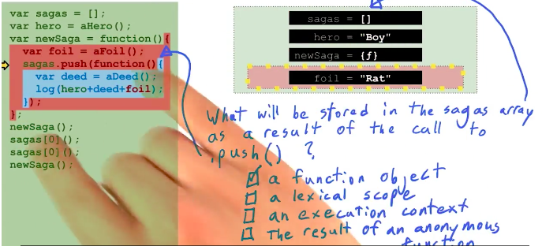
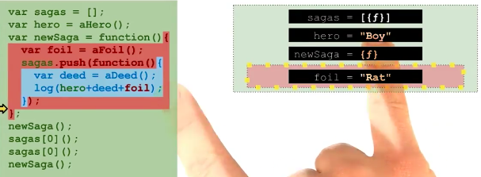
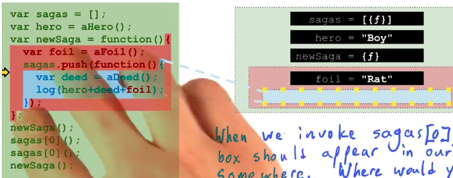
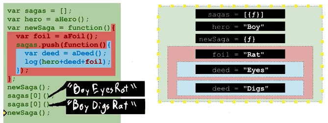
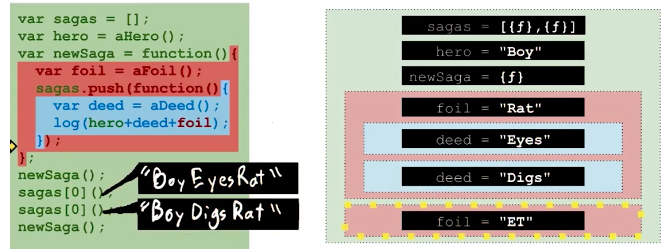
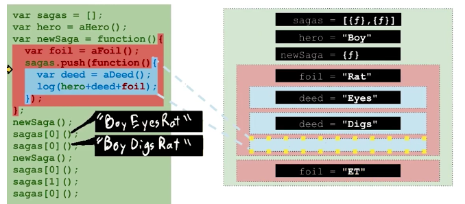
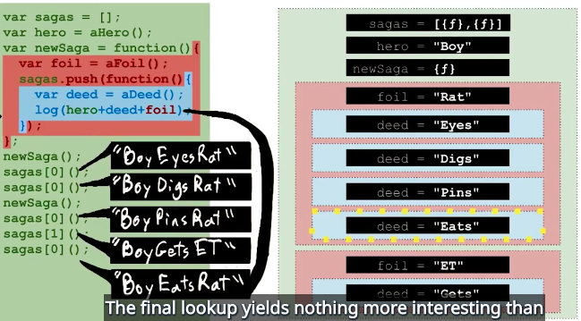

6# 闭包

## 1 闭包简介

简单来说每个函数都可以访问其外围作用域中的所有变量，闭包是指 通过某种方式在外围作用域执行结束后仍然可以访问其外围作用域中变量的一些函数。

## 2 练习 保留函数访问权限

```
var hero=aHero();
var newSage=function(){
    var foil=aFoil();
    var saga=function(){
        var deed=aDeed();
        log(hero+deed+foil);
    };
    saga();
    saga();
};
newSage();
newSaga();
```

**你认为以下哪种方法可以实现在newSaga调用完成后仍然可以访问函数saga?**

* 将saga传入setTimeout
* 在newSaga中返回saga
* 将saga保存为某个全局变量

> 答案是三种都可以


## 3 练习 预测代码输出


我们来创建一个名为sagas的全局变量，用它来存储一个数组，这个数组用来存储函数saga,接下来为了能永久访问saga函数，只需要将saga函数存入这个全局数组。

```
var sagas=[];
var hero=aHero();
var newSaga=function(){
    var foil=aFoil();
    sagas.push(function(){
        var deed=aDeed();
        log(hero+deed+foil);
    });
    sagas[0]();
    sagas[0]();
};

newSaga();
newSaga();
```

现在，即使在这些saga被定义的作用域之外，我们也可以访问它们，这些saga函数确实可以在创建它们的函数newSaga运行完毕之后运行，现在我们把这几行代码移到函数newSaga的两次调用之间如下，看看调用的结果如何。

```
var sagas=[];
var hero=aHero();
var newSaga=function(){
    var foil=aFoil();
    sagas.push(function(){
        var deed=aDeed();
        log(hero+deed+foil);
    });
    
};

newSaga();
sagas[0]();
sagas[0]();
newSaga();
```

第一行代码将创建一个数组，并将其存入一个名为sagas的全局变量。



这里将是我们最终存储每个saga函数的地方（省略一些步骤后）。现在我们要为newSaga找到这个函数对象，然后调用它，因为后面有这对括号



调用任何一个函数都会创建一个新的执行环境，这个执行环境便是所有查找开始之处，首先我们想其中添加了一个变量foil,
foil被赋值了随机字符串"Rat"下面有意思的来了，数组sagas现在被保存在一个全局变量中，也就是说调用它的push方法后，会持久化保存(添加内容)的效果，即便在newSaga完成运行之后，你认为什么将会添加入sagas中？答案是我们将在数组sagas中存储一个函数对象，从f到结尾的花括号是一个函数的定义部分，如下图。



也是我们用push方法添加到数组sagas中的值，事实上，词法作用域只是你在代码某处定义的文本字符而已，它并不是一个值存储在一个变量中或者作为数组的一个元素，执行环境类似于我们在右边画出来的方框，里面存储了键值对，从根本上来讲，执行环境无法被引用，同样的也无法存储在数组中，这里没有匿名函数被调用，最有可能的作为匿名函数被调用的是newSaga=function()后面的那个函数对象，但是因为它后面没带括号，表示该匿名函数没有被调用，因此也不会是匿名函数存入stagas里面。

# 4 预测执行环境

现在一个新的函数被添加到数组sagas之中，如下图。



尽管这个函数能被全局变量sagas数组索引到，但它自身的作用域仍是这个蓝色区域，因为其本质是在左边这个红色区域中被定义的，那么关键来了，如果我们试着运行一个函数saga会是什么结果，这些蓝色作用域的函数saga是在红色执行环境中被定义的，而我们现在从绿色执行环境访问它们的结果是什么？要知道，这个定义它的红色执行环境已经运行完毕并返回了，所以，被这个蓝色的函数引用的红色执行环境中的变量看起来已经无法访问了，当我们调用这个函数sagas[0],我们图中的某处应该会出现一个蓝色方框，根据你对这些环境机制的理解，你认为蓝色方框会出现在哪里？

当我们调用这个函数sagas[0]，图表中会在某处出现一个蓝色方框，根据你对这些环境的理解，你认为这个蓝色方框会出现在哪里？

* 在绿色方框以内、红色方框以外
* 在红色方框内
* 在红色和绿色方框以外

# 5 预测闭包输出

答案是这个蓝色方框应该出现在红色方框中，因为一个函数的执行环境总是在定义它的环境中被创建，换一个简单的思考方式，变量foil应可以从蓝色函数区域内被访问到，因为变量foil是它外层环境中的变量，如果这个蓝色方框出现在绿色方框中就不合理了，因为意味着他无法访问到变量foil。



# 6 预测闭包输出(2)

这个函数运行完以后，执行环境回到全局环境，然后我们再运行一次 sagas[0],再次运行该函数将创建一个不同于第一次的全新蓝色环境，新的deed变量被添加到新环境中，然后调用log函数，第一行代码生成了一个全新deed变量值并且这次log的输出内容也应不同了。

# 7 预测闭包输出（3）




现在我们继续运行newSage();注意 我们将创建一个全新的红色环境，它将包含一个新的变量foil以及两个新的蓝色环境，有趣的是在第二次调用push方法之后，现在数组拥有两个不同的函数对象，如下图：



为了进一步明确现在的情况，想象一下在程序结束之前，如果我们多次调用这两个不同的saga,再次运行第一个saga的结果应该和之前一样，尽管我们已经创建了第二个newSaga环境，在代码运行的过程中可以看到运行这个sagas内的函数对象将在第一个红色newSaga环境中创建一个新的蓝色sagas环境,如下。



这是因为我们运行的是数组中第一个saga函数，第一个saga函数被创建在第一个newSaga环境中，你认为这次的输出结果是什么？BoyPinsRat

# 8 预测闭包输出4

又到了一个有趣的关键点，我们将首次运行第二个saga函数sagas[1],你认为结果如何，一如即往地函数调用将创建一个新的环境，但这个环境将位于第二个红色区域内，这个红色区域是第二次调用这个newSaga函数时创建的，然后代码照常运行直到输出log的这行代码，你认为输出的结果是什么？

# 9 练习闭包输出5

现在进入最后一个有趣的问题，在调用sagas[1]函数之后，我们预测一下最后这行的输出（中的foil）会有改变吗？其实这个问题是一个陷阱，因为在函数saga创建新的蓝色区域之前，我们无从得知输出结果，因为环境生成之前我们无法得知此次调用sagas[0]时生成的deed值，所以这些deed值和最后这次函数调用的输出结果无关，我们来看看这次随机生成的变量值是什么。

# 10 预测执环境(2)

当我调用这个函数saga的时候，你认为新的蓝色环境将会出现在那个红色环境中？第一个，因为我们运行的是第一个saga函数，所以它将出现在第一个newSaga生成的环境中。

# 11 练习：预测闭包输出（6）



最终的结果没什么特别，就和之前调用第一个sagas[0]一样，就好像第二个函数saga从未被调用过，或者说它是否被调用过与此完全无关，这两次操作完全独立，另一环境中国的另一函数是否被调用不会影响当前环境下函数的调用。现在最后一次调用函数saga执行完毕，执行环境重新回到全局环境。

# 12 小结

我已经彻底理解解释器是如何执行我的代码以及变量作用域和闭包，这些能帮我写出简洁的应用，使其他程序员也能轻松阅读和理解。到时我们会学习编写属性为函数的对象作为返回值的函数，也就是函数会作为属性被存储在（作为返回值的）对象中，总体来说，每当你看到一个函数的输入参数是基本不需要变的，也就是说你不希望每次调用函数时参数是一个新的值，这时你就可以重构代码了，将这个值存储在一个外部作用域的变量中，根据闭包的原理，内层的函数随时都可以访问其外层的作用域中的变量，即使外层函数已经返回，就像说的，接下来会有很多示例。

