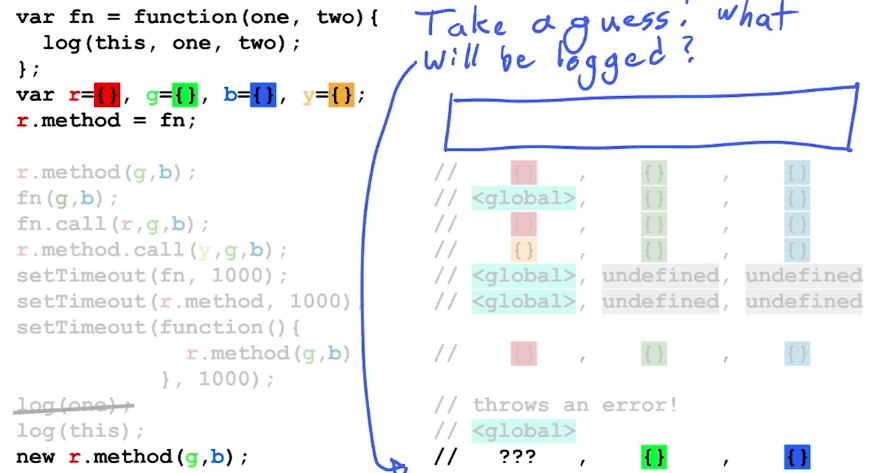

# 1 简介

我能想到每一种面向对象的编程语言都有动态引用当前对象的方法，在javascript中，我们使用关键词this来进行这种引用，但是我们都知道有时候这个this很容易让人搞不清楚它到底指的是什么，有时它返回的对象可能并不是你所期望的那个，甚至可以这样说this参数可能是这门语言中最容易被误解的一个概念了，但只要理解对了，它是非常便于使用的，你可能经常听别人说参数"this",这是因为他出了具有某些特殊性之外，它变现得跟普通参数几乎一模一样，参数就是在函数定义在圆括号里面的那个词，普通参数和this参数之间只有两个主要区别：第一个是你无法给this起名，它们永远都叫this,第二个区别是当你给this绑定值时会和给普通参数绑定值有点不一样，事实上接下来会看到大概5种不同的绑定方式，在这之前不妨花点时间看一眼dev tools中对它的定义，我们这个时候就会开始问这个参数this到底是和谁绑定的了。

# 2 定义关键词this

先来讨论下这个关键词this到底是干嘛用的，this是一个标志符，它需要和值进行绑定来使用，跟变量差不多，但是在你的代码中它并不是和某个具体的值进行绑定而是自动动态地绑定到某个对象上，判定this绑定对像的规则和位置参数的规则相似（可以参考python和shell的位参规则），它们之间不同的是this参数的设计遵循人类的直觉，其在调用函数或构造器时所绑定的对像和人类直觉上的判断一致，许多人在这一块有所误解，所以我们先列出一些不会被关键词this绑定的东西来帮助大家理清思路。

# 3 this不会绑定的

为了理解关键词this到底指代什么，我们需要一个包含关键词this的代码示例。

```
var fn=function(a,b){
log(this)
}
```

这里我们可以看到this参数用在函数内部，大家通常遇到的都是这种情况，如果你在函数中遇到了this,你认为它绑定的对象是什么？哪些是人们常常认为是this绑定的内容但实际上并不是，首先你们应该都看到了这里定义的函数，我们用蓝色标记了它，大家都知道当解释器运行到这里的时候将会在内存中创建一个函数对象。你可能会认为关键词this是指代这个函数对象，但事实并不如此，人们进而推测，由于创建了一个函数实例，那么关键词this应该指代的是它，这在某些情况下是正确的，但是为了真正理解，我要问问大家你认为这个函数的新实例是什么？准确的说，在你心中这个实例对象是什么？


稍后，我们将继续研究为什么上面的说法在某些情况下是对的，不过在现实世界中你很少能遇到这样的函数定义，为了能够比较、讨论我们先看一个错误的例子，一般来说这种想法基本上都是不对的，你可能会想为了让关键词this有意义，包含它的函数应作为某个对象的属性而存在。


这里我们定义一个对象ob2,它包含了一个名为method的方法存储了对上述函数对象的引用，其对应内存中的ob2对象，函数也作为属性被存储其中，所以内存中的ob2对象可能就是关键词this指代的内容，事实上这是最常见的误解之一，很遗憾这也是错误的，我们稍后就会明白，其实思考这个问题最简单的方式就是想想如果两个不同对象的属性都对应同一个函数，那么关键词this就会被强制要求在这两个对象中选择一个。


这显然是不合理的，我们接着思考this的指代问题，我们在函数中声明关键词this,并且将这个函数放在某个对象的花括号中或其他形式的函数定义中，这样，包围这个含有this的函数定义的外层对象会在内存创建一个对象，这可能是就关键词this指代的内容但这也是错误的，最后，我们调用这个函数。


当我们传入值与函数的位置参数进行绑定时，我们可以想象这次调用创建了一组绑定关系（形似箭值对）或一个区域，并且这组绑定关系会在内存中占用一部分空间，该绑定关系可能以对象的方式呈现，以上述情况为例a对应3,b对应4,我们也可以把它称为执行环境或者作用域。但这也不是关键词this指代的内容，从我们之前关于作用域的课程中，我们了解到this并不能对作用域进行引用。

# 4 ‘this’所绑定
以上就是关键词this不会指代的内容，那么关键词this指代的内容到底是什么呢？回到我们调用函数的实例中，我们注意到在这个示例的左边有一个点符号".",当函数被调用时，如果左边有一个点符号就意味着它会作为某个对象的属性被查找，点符号左边的就是this关键词绑定的内容，这是一个大致的定义90%的情况下都适用，因为当然，有时我们可能不会使用点符号访问这个函数，比如用中括号访问，这里点符号左边的对象正好与我们最初定义包含this函数的外层对象相同。事实上这只是一个巧合，如果这个函数也是其他对象的方法，我们也同样可以将其作为那个对象的属性调用，无论如何 将包含this的函数作为属性存储的对象。

# 7 预测this输出

你认为这里输出的是什么？

```

var fn =function(one,two){
    log(this,one,two)
};

var r={},g={},b={}

fn(g,b)
```
事实上这个问题也是陷阱，但我们暂时把它放在一边，在我们深入研究这个函数之前先来探究一下关键词this更常见的用法，这对我们的学习大有裨益。
这种常见的用法是 在方法调用中作为参数使用。

# 10 预测this输出4

.call要传入对象和参数进去。

```
var fn=function(one.two){
log(this,one,two)
}

var r={},g={},y={};
r.method=fn;
r.method.call(y,b,b)
```

# 11 预测this输出5

关于参数this很多人觉得很困惑的一点是在回调函数中它又将如何绑定，在这个示例中，我们将函数传入setTimeout,setTimeout的作用是将我们的函数延迟1秒再调用。正如你所见我们并未在回调函数fn中传入任何可作为实参的值，因此很难想象这段代码会如我们预期般运行。

```
var fn=function(one,two){
log(this,one,two)
};
var r={},g={},b={},y={}
r.method=fn;
setTimeout(fn,1000);
```
提示：记住在没有看到这个函数的具体调用之前，你是无法知道它的参数将会绑定什么值的，因此我们需要查看一下函数fn的调用。

# 12 解构setTimeout

假设setTimeout是用javascript实现的原生函数，我们可以查到它的文档，那就让我们看看它是如何实现的。它被定义于一个名为timers.js的文件之中，你认为这个文件中的内容是什么？我指的是首先需要一个函数定义，其中包含已定义的变量setTimeout并指向某个函数，这个函数有两个参数，你的回调函数名称以及调用回调函数之前等待的毫秒数，在这个函数体内将发生什么呢？首先系统会延迟一定的毫秒数，然后再执行你的回调函数，注意如果你了解javascript并发模型的话，你就会知道事实上这是不可能用javascript原生代码实现，但为了更好的理解，我们暂且将其想象为这样，下一步setTimeout将引用你的函数，并且用某种方式调用它，现在，我们终于可以问自己这个问题，setTimeout传入到回调函数中的值到底是什么，由于setTimeout无法知道你想要传入到函数中的值，它可能不得不在没有任何参数的情况下调用这个函数。如果是这种情况你认为log结果中最后一位将是什么？


答案是undefined,函数被调用时如果没有值被传入，参数就会绑定为undefined,

# 14 确定this绑定

    

跟决定参数绑定一样，我们需要查看setTimeout的最后一行代码，也就是ab被调用的地方，我们注意到这里没有点，那么就应该运用默认绑定规则来判断。

# 15 预测'this'输出 7

跟位置参数一样，参数this没有值被传入绑定，这是因为在访问回调函数时，它并没有作为属性被访问，我们假设的setTimeout的函数定义也并没有使用比如点符号调用的机制来调用cb函数。

# 16 预测'this'输出 8

    


根据传入函数时setTimeout的执行方式，你认为在传入一个方法而该方法又是某个对象的属性的情况下会发生什么？注意我们现在使用了点记法来引用这个方法并将其传入setTimeout中，我们首先考虑下这些位置参数将如何让执行，跟之前一样 由于在我们调用回调函数的地方并没有值被传入到圆括号中，它们被绑定为undefined,此外，任何可能会被传入到回调函数中的颜色对象都没有被传入到函数setTimeout中，所以setTimeout的函数无法知道你想要传入的值是什么，下一个问题是你认为参数this会被绑定为什么值？提示，想想我们应该查看那里来决定参数this的绑定，并不是在函数定义中也不是在函数所处的对象中，而是在这个cb函数被调用的地方，由于我们在红色对象中进行了属性查找，大家常会认为"查找"这个动作可能和参数中的关键字this有关，但实际上此时它们是不相关的，只有调用时的“查找”，才会影响参数this的绑定（此处的点符号只是传入了方法体本身），和之前的示例一样，只是我们传入了fn而非r.method,setTimeout的最后一行仍然是作为一个普通的函数被调用而非点标记方法调用，因此绑定的内容仍然是默认值global(全局对象)

# 17 预测‘this’输出 9

缺少参数绑定的问题很普遍，这是因为任何一个像setTimeout一样将另一个函数作为回调函数的函数在调用函数时都可能与你的预期发生偏差，回调函数本身就被设计为由它们被传入的系统调用，因此你基本无法控制传入的参数最终所绑定的值是什么，正因如此，你需要对所有的参数绑定都保持谨慎，包括参数this,每当你将一个函数作为输入参数传入另一函数时，尽管在传入时你看到有对象在点符号的左边，


但当系统最终调用你的回调函数时，这个对象并不会传入成为参数this的绑定，为避免将参数绑定复杂化，可以采取传入另一个函数（匿名函数）的方法，这个函数不需要任何参数，包括this,然后在这个函数体中腾出位置给你的自定义代码，在这个区域中引用你的代码并调用。

```
setTimeout(function(){
r.method(g,b)
},1000)

log(this)
```

传入你希望参数this绑定的内容，我们聊了很多关键词this出现在函数中的情况，也尝试传入一些需要绑定的值。

# 18 预测‘new’命令下的‘this’输出




答案：a brand new object

由于关键词new的运行机制，后台将创建一个全新的对象，而关键词this将被绑定到其上，为了支持某些面向对象的范例，每次使用关键词new来调用函数的时候，都会生成一个新的对象。


